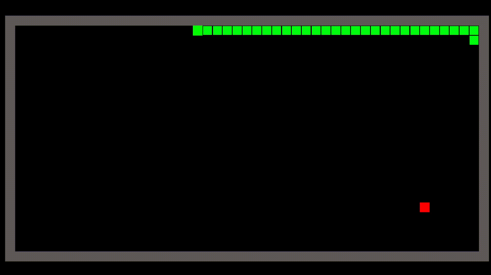
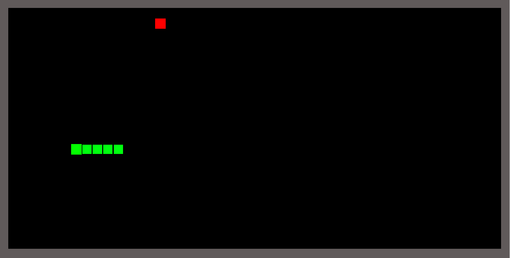
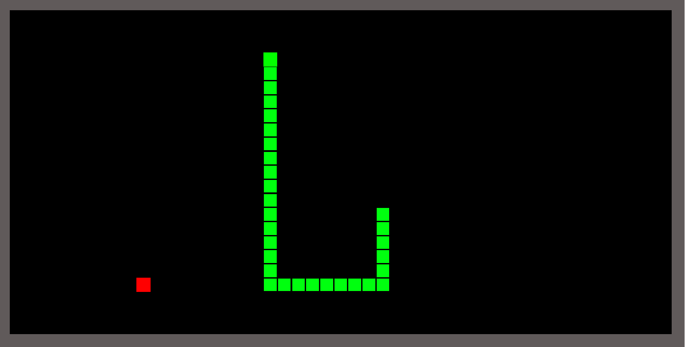

# Danger Noodle

---

### Table of Contents

- [Description](#description)
- [How To Play](#how-to-use)
- [Learned](#learned)
- [Author Info](#author-info)

---

## Description
Control snake in a way to collect food that makes him grow be careful not to eat your own tail.

---

## How To Play
> Press "W" to go up | Press "S" to go down | Press "A" to go left | Press "D" to go right 

---

## Learned 
- Use of the randomization 
- Better prefab menagement

---

## Author Info

- Twitter - [@MarceliKumiers1](https://twitter.com/MarceliKumiers1)
- LinkedIn - [Marceli Kuśmierski](https://www.linkedin.com/in/marceli-ku%C5%9Bmierski-321969165/)

[Back To The Top](#Danger-Noodle)
